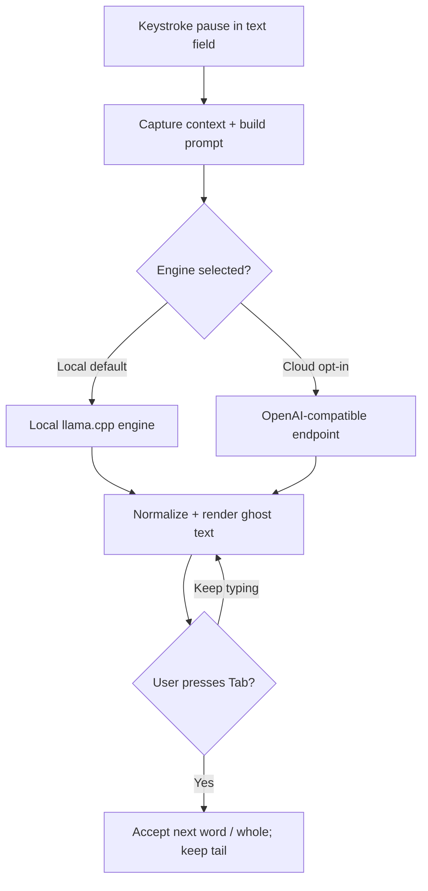
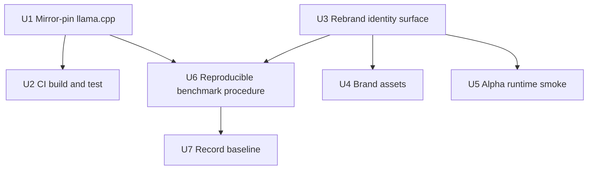

## Goal Capsule

- **Objective:** Mac users get a free, open-source, on-device autocomplete that produces smarter, better-tuned suggestions than Cotypist across the apps they write in, with a hybrid backend that keeps suggestion quality high even on Macs too small to fit a capable local model.
- **Means:** Fork KeyType and extend its module graph rather than rebuild the macOS integration layer (KD1, KD7, KD9).
- **Product authority:** This plan owns the Libretype product: a fork of KeyType, a port of TabType's context pipeline, and an added hybrid engine. Surrounding areas (Cotypist-tier polish, an Apple Intelligence engine, mobile and other platforms) are not active scope.
- **Execution profile:** Implementation Units cover S0 (U1–U5: fork foundation and buildable alpha) and S1 (U6–U7: evaluation baseline) only. Former U8/U9 and S2–S7 remain under Deferred to Follow-Up Work.
- **Stop conditions:** Stop and resolve before proceeding if the name-clearance gate G4 fails, if the S1 baseline shows the quality thesis in KD2 is not measurable on the inherited harness, or if research produces evidence that invalidates a settled decision.

---

## Product Contract

**Product Contract preservation:** changed — added R22 through R24 and KD9 through KD13, and closed A1/OQ1/G1 into KD13. R1 through R21 and KD1 through KD8 keep their IDs; **R1 wording was narrowed 2026-08-30** so coverage is no longer freely tradeable against quality (aligned with KD13). **KD2's meaning is constrained by KD13:** coverage (R13, R14) may be deferred but is not freely droppable. The additions come from `docs/research/2026-08-30-fork-architecture-anchors.md`, decisions settled in the planning conversation, and the 2026-08-30 audit/review write-back; no original requirement was reclassified or dropped.

### Summary

Libretype is a MIT-licensed, open-source macOS autocomplete app that beats Cotypist on suggestion quality. It forks KeyType (modular SwiftPM, llama.cpp engine, already shipping with encrypted writing-history personalization, model management, constrained-generation, and mid-line), adds a remote OpenAI-compatible engine for a hybrid backend (local by default, cloud API key for weak machines), and ports TabType's context pipeline (AX-tree transcripts, document-aware context, text-mirroring) into KeyType's existing context, compatibility, and UI packages. It is free, with a suggested $5 donation.

### Problem Frame

Cotypist proved system-wide, on-device LLM autocomplete for macOS: a ~3 GB local Gemma/Qwen model via llama.cpp, ghost text in any app, Tab to accept, learns your voice. It is closed-source and freemium ($8/$12/mo, 100 free words/day), so users who want it free and open have no polished option. The open alternatives each force a trade: KeyType is modular and MIT but has a weaker context pipeline; TabType has the deepest context pipeline but is alpha and Apple-Silicon-only; Cotabby is polished and has a hybrid engine but is AGPL. A user who wants to release a free, open, better-tuned alternative they own — for adoption, stars, and reputation, donation-supported — has to combine the best of these under a permissive license rather than pick one or rebuild from scratch.

### Requirements

**Suggestion quality**

- R1. Suggestions must be better-tuned than Cotypist for the same input, with suggestion quality prioritized over speed and RAM footprint when they conflict. Coverage (R13, R14) may be deferred by sprint order but must not be dropped — constrained by KD13.
- R2. The local engine must use base-model continuation: the prompt ends at the cursor, not a chat/instruct prompt.
- R3. The app must support mid-line completion (completing from the middle of a line, not only at the end).
- R4. The app must support constrained generation (logit masking / admissibility) to shape suggestions.

**Hybrid backend**

- R5. Suggestions must generate on-device by default via a local engine, with no network required for the default path.
- R6. The app must support an optional cloud engine using a user-supplied API key against an OpenAI-compatible endpoint, so Macs that cannot fit a capable local model still get high-quality suggestions.
- R7. The cloud engine must be opt-in and disclose the network use; it sends only a bounded request to the user-configured endpoint.

**Context and personalization**

- R8. The app must capture accessibility-tree transcripts of the visible conversation in chat apps and chat websites, normalized for prompt stability.
- R9. The app must be document-aware: in long-form writing apps it reads a window around the cursor plus the document's opening lines.
- R10. The app must learn the user's writing via encrypted on-device writing history (on by default, user-controllable) and use it to tune suggestions.
- R11. The app must render ghost text via text-mirroring where the host app requires it, so suggestions pixel-match across apps.
- R12. The app must apply per-app and per-website policies (enable/disable, context recipe, tone, language).

**Coverage**

- R13. The app must work across standard macOS text fields (Mail, Slack, Notes, browsers, Notion, etc.) without per-app setup for most apps.
- R14. The app must work in terminals, including AI-agent prompt boxes.
- R15. Where coverage conflicts with suggestion quality, quality wins; suppression is preferred over a wrong suggestion. Governs R13, R14.

**Privacy**

- R16. No text the user types leaves the device unless the user explicitly enables the cloud engine.
- R17. The app must never read password or secure fields.
- R18. Screen/OCR context must remain opt-in; personalization data must be stored encrypted on-device.

**Product, license, distribution**

- R19. The app must be open-source under MIT.
- R20. The app must be free, with monetization via a suggested $5 donation (Ko-fi / GitHub Sponsors) and no paywall.
- R21. The app must be rebranded from KeyType to Libretype in its user-visible surface: display name, bundle identifier, application-support container, and icon.

**Contributor onboarding and engine parity**

- R22. A clean clone of the repository must build without a manual bootstrap step. Upstream's llama.cpp binding is a gitignored local path, so a fresh clone currently fails to build (RN-1). Adoption is the success metric, and a broken first build is the largest single loss of contributors.
- R23. The remote engine must enforce the suppression discipline at the text level. `ConstrainedGeneration` operates on logits and is structurally unavailable to a remote engine (RN-2a), so without a text-level post-filter the remote path silently violates R15 while presenting itself as the higher-quality option.
- R24. Engine selection must be observable per request: which engine served it, its latency, and whether the result was shown or suppressed. Without this, the quality thesis in KD2 cannot be measured across a hybrid backend.

### Success Criteria

- SC1. A recorded quality baseline exists for the inherited benchmark suites, expressed in the harness's own metrics (`qualityScore`, `precisionWhenShown`, `wrongShowRate`, `suppressionAccuracy`), so every later quality claim is a measured delta rather than an assertion. Advances R1.
- SC2. A contributor who has never seen the project can clone and build it on macOS 14+ with no manual framework step and no undocumented prerequisite. Advances R22.
- SC3. Latency numbers are only ever quoted from release builds, matching the upstream constraint that debug inflates per-token work by one to two orders of magnitude. Advances R1.

### Key Decisions

- KD1. Fork KeyType as the base. (session-settled: user-directed — chosen over contribute-upstream / build-from-scratch / fork-TabType / fork-Cotabby: wants own MIT product to control, brand, and ship; KeyType's modular engine/app split and existing personalization, model management, and app compatibility minimize customization.) Governs R1–R21.
- KD2. Suggestion quality is the primary axis; speed and RAM are trade-able. Coverage (R13, R14) is constrained by KD13: it may be deferred but must not be dropped. (session-settled: user-directed quality-primary axis; KD13 later constrains the coverage trade.) Governs R1, R15; constrained by KD13.
- KD3. Hybrid backend: local llama.cpp plus an optional OpenAI-compatible cloud engine for weak machines. (session-settled: user-directed — chosen over local-only: quality on weak machines via cloud.) Governs R5–R7.
- KD4. MIT license; free with a suggested $5 donation; no paywall. (session-settled: user-directed — chosen over AGPL and over a paid tier: maximize adoption, stars, and dev reputation; donations, not a paywall.) Governs R19, R20.
- KD5. Name "Libretype" — own brand, "free type," no Cotypist echo. (session-settled: user-directed — chosen over Libretypist / Folktype / Openstroke / Freetypist: own brand that scales and signals free without copying the incumbent.) Governs R21.
- KD6. Port TabType's context pipeline (AX-tree transcripts, document-aware context, text-mirroring) into KeyType's existing packages rather than build context from scratch. (session-settled: user-approved — agent proposed the MIT-safe combine; user accepted.) Governs R8–R12.
- KD7. Reuse KeyType's engine/app architecture (ModelRuntime as the engine; the other packages as the app) rather than rebuild the macOS integration layer. (session-settled: user-directed — chosen over build-from-scratch: do not rebuild accessibility, ghost-text, and insertion plumbing.) Governs R5, R13, R14.
- KD8. No Cotabby code is used; its hybrid-engine pattern is re-implemented from scratch if referenced, to stay MIT. (session-settled: user-directed — chosen over an AGPL combine that includes Cotabby code: keep MIT.) Governs R19.
- KD9. Track KeyType as the `upstream` git remote and customize primarily by adding packages, not by renaming or structurally rewriting upstream identifiers. **Exception (KTD4/KTD10/U3):** minimal content edits to inherited files are allowed only for: (1) `CFBundleDisplayName` / bundle ids / Info.plist display surface, (2) Application Support directory-name constant consumers (KTD10 inventory), (3) self-detection + Correction `.dev` parity, (4) Keychain service strings, (5) user-facing copy (onboarding, window title, settings path strings), (6) scripts that embed App Support or product path strings. Those edits are expected merge points on every upstream pull and must stay as small as possible. (research-settled: upstream `AGENTS.md` mandates extending the module graph rather than rewriting it; the repository carries KeyType's history, so cheap merges are a standing asset. Chosen over a clean-room reimplementation and over a hard divergence.) Governs R1, R21, KD1, KD7.
- KD10. Port TabType once, per-file, with attribution headers; do not track it as a dependency. (research-settled: RN-4 — TabType's engine layer is MLX-based where Libretype is llama.cpp-based, so only the model-agnostic context files are portable. Chosen over a wholesale port and over a SwiftPM dependency.) Governs R8–R12, KD6.
- KD11. Bind llama.cpp as a checksum-pinned URL `binaryTarget` served from a **Libretype-controlled mirror** (same artifact bytes as upstream's validated llama.cpp xcframework build), not from the ggml-org GitHub release CDN that ADR-007 abandoned. Keep a documented local-path override for llama.cpp development only — it is not the R22/SC2 fallback. (audit-settled 2026-08-30, closing OQ3 — chosen over pinning to github.com/ggml-org/llama.cpp/releases, over local-path as the clean-clone path, and over building llama.cpp from source in-repo. llama.cpp documents the URL+checksum form; ADR-007 prefers that form once a reliable mirror exists.) Governs R22.
- KD12. Introduce a suggestion-level engine seam (request in, result out, with partial streaming) above `LocalModelRuntime`, and route local versus remote there. (research-settled: RN-2 — `LocalModelRuntime` is token/logit-level and cannot be satisfied by a remote API that returns text; upstream ADR at `docs/05-decisions.md:527` requires the protocol stay linear and stable for `StubModelRuntime`. Chosen over widening `LocalModelRuntime` and over a remote-only fake runtime.) Governs R5–R7, R23, R24, KD3.
- KD13. Libretype's durable edge against a future Apple-native system-wide autocomplete is personalization, model freedom, and terminal/all-app coverage — not a bigger or better model. (session-settled: user-directed, closing gate G1 and assumption A1 — chosen over "raw quality from a bigger local model" and over "being free and open source is itself the edge". Forward-looking Apple-behavior clauses are **ASSUMPTION** — see `docs/research/2026-08-30-plan-review-evidence.md`.) Consequence: coverage stops being freely trade-able despite KD2 — R13 and R14 may be deferred but not dropped. Governs R8–R12, R13, R14; constrains KD2.

### Research Gates

Each gate must close before the sprint it blocks. An unresolved gate is a reason to stop, not a reason to guess.

| Gate | Question | Blocks | Method |
| --- | --- | --- | --- |
| ~~G1~~ | ~~Durability thesis~~ | — | Closed 2026-08-30 → KD13. |
| G2 | Which local model, at which quantization, on which hardware floor? | S2 | Measure candidates on the S1 baseline (U7); decide on quality-per-GB, not reputation. |
| G3 | Does TabType's text-mirroring overlay survive a port to llama.cpp (A2, A3, OQ2)? | S3 | Port mirroring alone and measure. Do not port the file set speculatively. |
| G4 | Is "Libretype" clear of trademark and domain collisions (A4)? | Making the repository public | USPTO, App Store, and `.app`/`.dev` availability. |
| G5 | Apple Developer ID, notarization, and Gatekeeper path for an unsigned fork. | S7 | Apple developer documentation; determines whether v1 installs without a right-click bypass. |
| G6 | Intel Mac support: does the llama.cpp path stay usable, and at what quality floor? | S2 | Measure on the S1 baseline. Upstream targets macOS 14+ with no Apple-Silicon restriction, so this is a quality question, not a compatibility one. |
| G7 | Which remote endpoints are supported (RN-3)? | S5 | `/v1/completions` is the baseline and `/infill` an optional capability; hosted providers deprecating raw-prompt completions may break the base-model premise. |

### Key Flows

- F1. Suggestion generation.
  - **Trigger:** The user pauses typing in a focused text field.
  - **Actors:** Local engine (default), cloud engine (opt-in).
  - **Steps:** Capture context (AX transcript / document window / writing history) → build a base-continuation prompt → route to the selected engine → generate → normalize → render ghost text.
  - **Covered by:** R1–R4 and R15 for quality/continuation behavior in this plan's active scope; R5–R7 (F2/S5); R8–R12 (S3–S4); R13–R14 (S6). Active units U1–U7 do not deliver R8–R14.

- F2. Hybrid engine selection.
  - **Trigger:** A generation request is built.
  - **Steps:** The router selects the local engine by default, or the cloud engine when the user has enabled it and supplied an API key.
  - **Covered by:** R5–R7.

- F3. Acceptance.
  - **Trigger:** The user presses Tab while a suggestion is shown.
  - **Steps:** Accept the next word (or the whole suggestion), insert it, and keep the remaining tail alive for the next accept.
  - **Covered by:** inherited Tab-accept UX (smoke-verified in U5); not a coverage requirement — R13/R14 own app/terminal reach and land in S6.

### Acceptance Examples

- AE1. **Covers R5–R7.** **Given** a Mac that cannot fit the chosen local model, **when** the user enables the cloud engine and supplies an API key, **then** suggestions come from the user-configured OpenAI-compatible endpoint and the UI discloses the network use; without the key, the local engine is used and no network call is made.
- AE2. **Covers R8, R9.** **Given** the user is typing in a chat app, **when** a suggestion is requested, **then** the prompt includes the normalized AX-tree transcript of the visible conversation; **given** a long-form writing app, **then** it includes the document's opening lines plus a window around the cursor.
- AE3. **Covers R15.** **Given** an app where rich context is unavailable or low-confidence, **when** context richness conflicts with suggestion quality, **then** the app suppresses the suggestion rather than showing a low-quality one, even if that means no suggestion in that app.
- AE4. **Covers R17.** **Given** focus is in a password or secure field, **when** a generation would otherwise fire, **then** no generation, presentation, or insertion occurs. (R16 stays inherited local-default until S5; R18's S0 mechanization is U3's Keychain/container isolation plus OCR-off-by-default — not this AE.)

### Scope Boundaries

**Deferred for later**

- Cotypist-tier polish: emoji shortcodes, inline macros, autocorrect, a Homebrew cask, notarization, and Sparkle-style auto-update.
- An Apple Intelligence (FoundationModels) engine.
- Mobile (iOS/iPadOS), Windows, and Linux.
- Intel-Mac optimization (supported by the llama.cpp path but not tuned).
- Model fine-tuning or training a custom model.
- A paid tier.

**Outside this product's identity**

- A closed-source or proprietary product — Libretype is open-source MIT.
- A cloud-dependent product — the default is on-device; the cloud engine is opt-in.
- A Cotypist-derivative brand — Libretype is its own brand, not a "free Cotypist" clone.

#### Deferred to Follow-Up Work

These are planned Libretype work, sequenced after this plan's units rather than excluded. Each is planned when its gate closes.

- S2 — accessibility-tree transcript context (R8). Blocked on G2 and G6.
- S3 — document-aware framing and text-mirroring (R9, R11). Blocked on G3.
- S4 — personalization and phrase memory (R10, R12).
- S5 — the suggestion-level engine seam, the remote engine, its text-level suppression filter, and per-request engine attribution (R6, R7, R23, R24, KD12). Blocked on G7.
- S6 — terminal and broad app coverage (R13, R14).
- S7 — polish, signing, and the v1 release (G5).
- U8 — benchmark-harness CI smoke (was tentatively in S1; deferred to the first sprint that edits `Packages/KeyTypeBench` scoring/schema). Until then U2 may optionally run `swift test` in that package.
- U9 — enforceable quality-gate thresholds (was tentatively in S1; deferred until G2 selects the shipping model). U7's dated baseline remains the measurement artifact; thresholds derive from the G2-selected row.
- Renaming upstream's internal Swift target, scheme, and package identifiers. Held out deliberately per KTD4.
- A Libretype-owned benchmark suite for conversation-context cases. It lands with S2, when there is transcript context to measure.

### Dependencies / Assumptions

**Dependencies**

- KeyType (github.com/johnbean393/KeyType, MIT) as the fork base — modular SwiftPM packages, llama.cpp engine, encrypted writing-history personalization, model management, constrained-generation, mid-line, tests and bench, macOS 14+.
- TabType (github.com/nilava/TabType, MIT) as the context-pipeline port source — AX-tree transcripts, phrase memory, per-app policies, document-aware context, text-mirroring; MLX backend, Apple-Silicon-only.
- llama.cpp prebuilt xcframework, checksum-pinned and served from a Libretype-controlled mirror (bit-identical to upstream's validated build).
- An OpenAI-compatible endpoint (user-configured) for the cloud engine.
- macOS 14+.

**Assumptions**

- ~~A1. Durability thesis~~ — resolved 2026-08-30, promoted to KD13.
- A2. TabType's speculative-parking mechanism (a `speculative` flag in its `SuggestionEngine`) ports to KeyType's llama.cpp runtime; the exact parked-generation mechanism was not pinned in the audit and may need rework rather than copy.
- A3. The port's hardest piece is adapting TabType's MLX-coupled text-mirroring overlay and speculative-parking to llama.cpp; the AX-tree transcript and document-aware parts are largely model-agnostic and port cleanly.
- A4. The name "Libretype" is clear of trademark and domain collisions; unverified, and G4 owns closing it.

### Outstanding Questions

- ~~OQ1~~ — resolved 2026-08-30 as KD13.
- OQ2. **Deferred to S3 planning.** Pin TabType's speculative-parking mechanism (A2) against its `MLXEngine` and `SuggestionEngine`, and decide port versus rework for the llama.cpp runtime. Tracked as G3.
- ~~OQ3~~ — resolved 2026-08-30 (audit): pin via Libretype-controlled mirror (KD11/KTD1); local-path override is llama.cpp-dev only, not the R22 fallback.

---

## Planning Contract

### Implementation approach

S0 makes the fork buildable, owned, and branded; S1 makes its quality measurable. Neither sprint touches the suggestion pipeline. The work concentrates in five places: the llama.cpp binding in `Packages/ModelRuntime/Package.swift`, a shared application-support directory-name constant in `AutocompleteCore` (KTD10), the identity surface (Xcode build settings, brand assets, self-detection, Keychain service), a new `.github/workflows/` tree, and the inherited benchmark harness under `Packages/KeyTypeBench/` and `KeyTypeBench-20260603/`.

Three requirements arrive already satisfied by upstream and need no units here: R2 (base-model continuation), R3 (mid-line completion, via `allowsMidLineCompletion`), and R4 (constrained generation, via `Packages/ConstrainedGeneration/`). The S1 baseline measures them rather than building them. R10's encrypted writing-history store also already exists in `Packages/Personalization/`; S4 tunes it rather than creating it.

### Key Technical Decisions

- KTD1. Pin the llama.cpp xcframework by URL and checksum against a **Libretype-controlled mirror**, using the same artifact bytes as upstream's validated build (ADR-007's `b9402`-class pin or its successor). Instantiates KD11 and governs R22. Do **not** pin to `github.com/ggml-org/llama.cpp/releases` (the CDN ADR-007 abandoned). Keep the local-path binding as a documented override for llama.cpp development only — it must not be the clean-clone path. **Pin-bump policy:** any change to the mirrored URL or checksum requires a new ADR and a re-run of the U7 baseline. **Authenticity:** before publishing a mirror asset, record in the U1 ADR (a) upstream tag, (b) GitHub Releases asset digest for that zip when available, (c) `swift package compute-checksum` of the bytes uploaded to the Libretype host — all three must agree; CI already rejects ggml-org hosts (U2). Closing OQ3.
- KTD2. Use `io.github.sajor2000.libretype` as the bundle identifier (and `io.github.sajor2000.libretype.dev` for the `.dev` product used by `Scripts/build-dev-app.sh` and tests). (session-settled: user-directed.) Governs R21.
- KTD3. Rename the application-support container to `Libretype` and ship no migration from KeyType's container. (session-settled: user-directed.) Governs R21. Consequence: an orphaned `~/Library/Application Support/KeyType` directory may remain; release notes must say so. Keychain service strings must differ from KeyType **and** between Libretype production and `.dev` (see U3).
- KTD4. Rebrand the user-visible surface — display name (`CFBundleDisplayName` / `INFOPLIST_KEY_CFBundleDisplayName` set to Libretype while `TARGET_NAME`/`PRODUCT_NAME` stay KeyType), bundle identifier, container directory, icon, user-facing copy, and documentation — and keep upstream's internal Swift target, scheme, package identifiers, and entitlements filename. Logger `subsystem:` strings are **out of scope** for S0 (operators filter on `com.pattonium.KeyType` until a later polish pass); retarget is owned by **S7 polish** (or an earlier polish PR if operators need it sooner) — not an open-ended deferral. Governs R21 and honors KD9's rebrand exception. `KeyTypeBench`, `KeyType.xcodeproj`, and `KeyType/KeyType.entitlements` keep their names.
- KTD5. Land the identity/code rebrand (U3) as one isolated commit. Brand assets (U4) may follow in a second commit on the same sprint; together they close R21 before S0 DoD. (session-settled one-commit intent narrowed 2026-08-30 audit: identity isolation is the merge-critical slice; icons are visual and do not need to share that commit.) Governs R21, KD9.
- KTD6. Extend the inherited `KeyTypeBench` harness rather than build a Libretype evaluation harness. (session-settled: user-approved.) Governs R1, SC1. Scorecard shape alone does not prove KD2 measurability — U7 must check whether gating suites can move under a plausible Libretype change before treating the baseline as decision-grade (Goal Capsule stop condition).
- KTD7. Introduce CI now: build and test on every push in S0. Optionally run `swift test` for `Packages/KeyTypeBench` inside U2. A dedicated benchmark-smoke workflow (former U8) is deferred to the first sprint that edits harness scoring/schema. Governs R22, SC2. The committed-manifest remote-`binaryTarget` guard lives in CI (U2).
- KTD8. Keep the repository private until G4 closes. (session-settled: user-directed.) Governs R21.
- KTD9. Measure the S1 baseline on the inherited public suites only and record dated numbers (U6–U7). Do **not** freeze enforceable quality-gate thresholds in S1 while G2 is open; former U9 moves to Deferred / S2 opener after G2 selects the shipping model. Governs R1, SC1.
- KTD10. Put the application-support directory name in `AutocompleteCore`, and have `ModelContainer` plus every Application Support directory-name consumer use it — including `PersistentWritingHistoryStore`, `CompletionTelemetry`, `PredictionLog`, `FullPromptLog`, and **`DeveloperOverrideController`** (fifth site: bare `appendingPathComponent("KeyType")`). Also update `Scripts/build-acpf-profile.sh` and any user-facing Models path strings listed in U3. (audit-corrected 2026-08-30 — deepening missed the DeveloperOverrides writer.) Expect recurring upstream-merge conflict on these files; the U3 ADR must include this **merge checklist:** (1) re-run `rg 'Application Support.*KeyType|appendingPathComponent\\(\"KeyType\"\\)'` and keep hits only behind the AutocompleteCore constant; (2) confirm Keychain service strings still derive from Libretype bundle ids; (3) confirm self-detection still covers Libretype prefix + `com.pattonium.keytype` co-install exclusion; (4) leave Logger subsystems alone unless intentionally in a polish PR. Governs R21, KTD3, KD9.

### High-Level Technical Design

Active units for this plan: U1–U7. Former U8/U9 are Deferred. S0 identity work (U3) does not depend on U1; U5 depends on U3 only (placeholder icon OK). U4 finishes R21 before S0 DoD but does not gate U5.

The binding change in U1 is a swap of one `binaryTarget` form for another, holding the artifact bytes constant and changing only the download host to a Libretype-controlled mirror.

| Aspect | Inherited (local path) | Libretype (mirrored URL + checksum) |
| --- | --- | --- |
| Source of the framework | Developer builds it locally | Downloaded from a Libretype-controlled mirror of the validated artifact |
| Clean-clone build | Fails until built by hand | Succeeds without manual bootstrap |
| Reproducibility | Whatever the developer built | Fixed by checksum |
| Patched llama.cpp development | Default | Documented local-path override (not R22 path) |

---

## Implementation Units

### U1. Pin llama.cpp via Libretype-mirrored URL binary target

- **Goal:** A clean clone builds with no manual framework step, without depending on the ggml-org GitHub release CDN.
- **Requirements:** R22, SC2. Implements KTD1 and KD11.
- **Dependencies:** none.
- **Files:**
  - `Packages/ModelRuntime/Package.swift` — replace the local-path `binaryTarget` with URL+checksum pointing at the Libretype mirror.
  - Release asset hosting for the xcframework zip (this repo's GitHub Releases or equivalent durable host) — bit-identical to upstream's validated build.
  - `docs/05-decisions.md` — ADR: binding change, ADR-007 relationship, mirror host, pin-bump policy.
  - `CONTRIBUTING.md` — override procedure for llama.cpp development only; state that clean-clone uses the mirror, not Vendor/.
- **Approach:**
  1. Select the llama.cpp build matching upstream's validated artifact (`b9402` or successor); download once from the upstream release only to obtain bytes; host a checksummed copy on the Libretype mirror (this repo's GitHub Releases or equivalent).
  2. Pin URL+checksum in `Package.swift` to that mirror — not `github.com/ggml-org/llama.cpp/releases`.
  3. In the U1 ADR, record upstream tag + GitHub asset digest (when present) + `swift package compute-checksum` of the uploaded zip; refuse the pin if they disagree.
  4. Keep `Vendor/` gitignored for the local-path override (llama.cpp-dev only).
  5. Manifest remote-form + mirror-host guard lives in U2 CI.
  6. Update `CONTRIBUTING.md` in the same unit: clean-clone uses the mirror; Vendor is llama.cpp-dev only.
- **Patterns to follow:** ADR-007; llama.cpp `docs/xcframework.md` URL+checksum example.
- **Test scenarios:**
  - Existing `ModelRuntime` / `LlamaModelRuntime` tests pass against the downloaded framework (linking requires the binaryTarget to resolve).
  - The `ModelRuntime` protocol/`StubModelRuntime` *target* builds without the framework; the package `testTarget` that depends on `LlamaModelRuntime` still needs the pin to resolve (clarify ADR-007: stub target ≠ package `swift test` graph).
- **Verification:** fresh clone builds without manual Vendor bootstrap; checksum matches; ADR names mirror host and pin-bump policy.

### U2. Add a build-and-test CI workflow

- **Goal:** Every push proves a clean checkout builds and tests pass, and the committed llama.cpp binding stayed the mirrored remote form.
- **Requirements:** R22, SC2. Implements KTD7.
- **Dependencies:** U1.
- **Files:** `.github/workflows/ci.yml`
- **Approach:**
  1. macOS 14+ runner; build/test packages under `Packages/` plus the app target.
  2. Cache the resolved xcframework by checksum.
  3. Assert committed `Package.swift` has remote `binaryTarget` with non-empty checksum (not local-path `llama`).
  4. Fail if the `binaryTarget` URL matches `github.com/ggml-org/llama.cpp/releases` or otherwise is not the approved Libretype mirror host.
  5. Optionally `swift test` `Packages/KeyTypeBench` (stand-in until deferred U8).
  6. No latency/quality gates.
- **Patterns to follow:** `Scripts/build-dev-app.sh`.
- **Test expectation:** none as app behavior — CI config; fail when manifest reverts to local path, points at ggml-org CDN, or a package test breaks.
- **Verification:** green on clean runner; fails on broken tests, local-path binding, and non-mirror host.

### U3. Rebrand the user-visible surface

- **Goal:** The app presents as Libretype and owns identity, data location, and encryption-key namespace.
- **Requirements:** R21; advances R18 isolation (Keychain + container). Implements KTD2–KTD5, KTD10.
- **Dependencies:** none (parallel with U1).
- **Files:**
  - `Packages/AutocompleteCore/Sources/AutocompleteCore/ApplicationSupportDirectory.swift` — shared directory-name constant.
  - `Packages/AutocompleteCore/Tests/AutocompleteCoreTests/ApplicationSupportDirectoryTests.swift`
  - `Packages/ModelRuntime/Sources/ModelRuntime/ModelContainer.swift` — consume constant.
  - `Packages/Personalization/Sources/Personalization/PersistentWritingHistoryStore.swift`
  - `Packages/Personalization/Sources/Personalization/CompletionTelemetry.swift`
  - `Packages/Personalization/Sources/Personalization/KeychainPassphrase.swift` — derive `service` from `Bundle.main.bundleIdentifier + ".history"` (prod `io.github.sajor2000.libretype.history`; `.dev` `….libretype.dev.history`); keep API `service:` override for tests.
  - `KeyType/Logic/Telemetry/PredictionLog.swift` — path + `import AutocompleteCore`.
  - `KeyType/Logic/Telemetry/FullPromptLog.swift`
  - `KeyType/Logic/Developer/DeveloperOverrideController.swift` — fifth App Support writer (`appendingPathComponent("KeyType")`).
  - `KeyType/Logic/Completion/CompletionController.swift` — self-detection: `Bundle.main` equality + prefix `io.github.sajor2000.libretype`; **keep** excluding co-installed KeyType via `com.pattonium.keytype` prefix **and** retain `appName` contains `"KeyType"` as AX fallback (PRODUCT_NAME stays KeyType; see Approach).
  - `KeyType/Logic/Context/ContextCaptureController.swift` — same self-detection rules (including `shouldPreserveLatestTunableSnapshotOnMissingSnapshot`).
  - `KeyType/Logic/Correction/CorrectionController.swift` — replace exact `com.pattonium.KeyType` match with the same Bundle.main / libretype-prefix / `com.pattonium.keytype` / appName rules (`.dev` parity).
  - `KeyType/Logic/KeyTypeModuleGraph.swift`
  - `KeyType/App/KeyTypeApp.swift` — window title.
  - `KeyType/Views/Setup/OnboardingView.swift` — Welcome/Enable copy.
  - `KeyType/Views/Settings/Sections/ModelSettingsView.swift` — user-facing KeyType strings.
  - `KeyType/Views/Settings/Sections/DeveloperSettingsView.swift` — path copy if present.
  - `KeyType/Info.plist` and/or `KeyType.xcodeproj/project.pbxproj` — set `CFBundleDisplayName` / `INFOPLIST_KEY_CFBundleDisplayName` = Libretype; keep `TARGET_NAME`/`PRODUCT_NAME` = KeyType; set bundle ids; do **not** rename entitlements.
  - `KeyTypeTests/KeyTypeTests.swift` — `.dev` fixtures.
  - `Scripts/build-dev-app.sh`, `Scripts/prepareRelease.sh`, `Scripts/release.sh`, `Scripts/build-acpf-profile.sh`
  - `Packages/ProfileBuilder/Sources/acpf-build/ACPFBuildCommand.swift`
  - `.gitignore` — add `KeyTypeBench-20260607/Results/`; **`git rm --cached`** existing tracked files under that tree.
  - `docs/05-decisions.md` — ADR: rebrand, no-migration, KTD10 sites + merge checklist, Keychain strings, display-name mechanism.
  - `Packages/ModelRuntime/Tests/ModelRuntimeTests/ModelContainerTests.swift`
- **Approach:**
  1. AutocompleteCore constant first; route every App Support directory-name site (including bare `"KeyType"` components and listed scripts/strings); follow KTD10 merge checklist in the U3 ADR.
  2. Display name via `CFBundleDisplayName`, not by renaming the Xcode target.
  3. Pin Keychain services per KTD2 (`Bundle.main.bundleIdentifier + ".history"`); assert isolation in tests.
  4. Self-detection (settled): `Bundle.main` + `io.github.sajor2000.libretype` prefix for Libretype identities; **keep** `com.pattonium.keytype` prefix exclusion for co-installed KeyType; **keep** `appName` contains `"KeyType"` as AX fallback (PRODUCT_NAME remains KeyType). Fix Correction for `.dev` parity with Completion/ContextCapture.
  5. No KeyType container migration; release-note orphan retention.
  6. One isolated commit for this identity/code slice (KTD5); U4 icons may follow separately.
- **Test scenarios:**
  - Constant is `Libretype`; listed runtime writers and scripts derive from it (no remaining App Support `KeyType` directory-name literals in those sites).
  - `DeveloperOverrideController` resolves Application Support via the AutocompleteCore constant (no bare `KeyType` path component).
  - `CFBundleDisplayName` is Libretype while `PRODUCT_NAME` stays KeyType.
  - Keychain: `KeychainPassphrase` round-trip under prod service cannot be read under `.dev` or legacy `com.pattonium.KeyType.history`; clear-data scoped to Libretype leaves a KeyType-service item intact when both exist in the test harness.
  - Self-detection covers Libretype prod and `.dev`; Correction matches Completion/ContextCapture; co-installed `com.pattonium.KeyType` remains excluded.
  - Existing KeyType container untouched.
- **Verification:** Dock/About show Libretype; writes under Libretype container; distinct Keychain; no self-capture; 20260607 Results untracked + ignored.

### U4. Produce the Libretype brand assets

- **Goal:** Distinct Dock/menu mark for R21 (private-alpha bar: one legible variant set; accent/README polish may wait for S7).
- **Requirements:** R21. Implements KTD4.
- **Dependencies:** U3.
- **Files:** `KeyType/KeyType.icon/Assets/`, `KeyType/Assets.xcassets/AppIcon.appiconset/`, `KeyType/Assets.xcassets/AccentColor.colorset/`, `.github/images/app-icon.png`
- **Approach:** Ship a clear mark in the existing three-variant layout; fine-tune accent/README before public listing if needed.
- **Test expectation:** none — visual.
- **Verification:** legible at 16–512 pt; Dock/menu show the mark. Does **not** gate U5.

### U5. Prove the rebranded alpha runs end to end

- **Goal:** Rebranded build still completes ghost text + Tab accept under the new identity, without self-capture.
- **Requirements:** R21, AE4. Verifies inherited Tab-accept UX; does **not** deliver R13 (S6 owns coverage).
- **Dependencies:** U3 only (placeholder icon OK).
- **Files:** exercises `Scripts/build-dev-app.sh` (`.dev` identity); unit fixtures for prod bundle id in `KeyTypeTests`.
- **Approach:** fresh accessibility grant; model in Libretype container; plain + browser fields; self-exclusion including `.dev`. Primary interactive smoke is `.dev`; prod self-exclusion is covered by unit fixtures + optional release checklist (not a second full clean-machine smoke in S0).
- **Test scenarios:**
  - Ghost text + Tab accept; next-word tail kept (`.dev` via `build-dev-app.sh`).
  - AE4: focus a secure/password field — no ghost text; `predictions.log` (or probe) records `secureFieldExcluded` / equivalent suppress (not merely silent absence). Automated baseline: existing `CandidateFilter` / KeyTypeBench secure-field suppress cases stay green.
  - Model found in Libretype container; cancel-on-keystroke.
  - Self-exclusion: `.dev` interactive smoke + unit fixtures for prod bundle id `io.github.sajor2000.libretype` and co-installed `com.pattonium.KeyType`.
- **Verification:** clean-machine `.dev` smoke + prediction log + unit fixtures for prod/co-install self-exclusion + AE4 suppress reason.

### U6. Make the benchmark run reproducible and documented

- **Goal:** Anyone can reproduce a Libretype quality measurement from the repo alone.
- **Requirements:** R1, SC1, SC3. Implements KTD6, KTD9.
- **Dependencies:** U1; U3 (gitignore + `git rm --cached` for `KeyTypeBench-20260607/Results/` must land before writing baseline artifacts).
- **Files:**
  - `docs/09-benchmark-datasets.md` — procedure; **require `--output` (or equivalent) into `KeyTypeBench-20260607/Results/`** so artifacts do not land in the harness default `KeyTypeBench-20260603/Results/`.
  - `KeyTypeBench-20260603/Scripts/run_model_comparison.sh` — document/parameterize outputs to the 20260607 drop folder.
- **Approach:** Fix suites/split/decoder settings; release-build latency only; one shared results path with U3 gitignore + U7.
- **Test scenarios:** documented `smoke` run; deterministic outcome counts; clear error on missing model; smoke with `--output` writes only under `KeyTypeBench-20260607/Results/` with model/quant/suite naming (default path without `--output` must not be accepted as the Libretype baseline).
- **Verification:** reader reproduces `smoke` into `KeyTypeBench-20260607/Results/` naming model/quant/suite.

### U7. Record the baseline across candidate models

- **Goal:** Dated quality/latency baseline for candidate models; feed G2/G6; check KD2 measurability.
- **Requirements:** R1, SC1, SC3.
- **Dependencies:** U6.
- **Files:** `KeyTypeBench-20260607/Results/` (gitignored, untracked); `docs/09-benchmark-datasets.md` baseline table.
- **Approach:**
  1. Release-build runs; report harness metrics per model + hardware.
  2. Mark infeasible candidates explicitly.
  3. **Exit check:** state whether each gating suite can move under a plausible Libretype change; if not, invoke Goal Capsule stop condition and keep thresholds informational (do not invent U9 gates in S1).
- **Test scenarios:** one dated row per candidate model+quant+hardware with SC1 metrics; infeasible rows marked; KD2 exit check is a written yes/no per gating suite with a one-line reason (falsifiable in the baseline doc, not CI).
- **Verification:** reproducible via U6; metrics + hardware recorded.

### ~~U8~~ Deferred — benchmark smoke workflow

Moved to Deferred to Follow-Up Work. First sprint that edits `Packages/KeyTypeBench` scoring/schema owns `.github/workflows/bench.yml`. Until then U2 may run package tests optionally.

### ~~U9~~ Deferred — quality gate thresholds

Moved to Deferred / S2 opener after G2. U7 baseline is the measurement artifact; thresholds derive from the G2-selected model row (useful-behavior floor + wrong-show ceiling).

---

## Risks & Dependencies

| Risk | Why it matters | Mitigation in this plan |
| --- | --- | --- |
| Split Application Support container | Five+ directory-name sites including DeveloperOverrides | KTD10 + U3 inventory + merge checklist |
| Self-detection / appName heuristic | Bundle-id-only edits leave `.dev` or KeyType-name heuristic wrong | U3 prefix + Correction parity; decide KeyType `appName` policy |
| Shared Keychain (KeyType or .dev) | Clear-data destroys another identity's passphrase | Per-bundle-id service strings |
| Orphaned KeyType container | No migration | Release notes; do not delete |
| ggml-org CDN | ADR-007 abandoned it for R22 | Libretype mirror (KTD1); local path = dev only |
| Tracked 20260607 Results | gitignore alone insufficient | `git rm --cached` + ignore in U3 |
| Bench path mismatch | CLI defaults to 20260603 | U6 forces output to 20260607 |
| Entitlements rename | Breaks signing | Keep filename (KTD4) |
| Display name vs PRODUCT_NAME | Target stays KeyType | Explicit `CFBundleDisplayName` |

---

## Verification Contract

| Gate | Method | Applies to | Pass condition |
| --- | --- | --- | --- |
| Package build | `swift build` in touched packages | U1, U3 | Clean clone; mirror pin resolves |
| Package tests | `swift test` | U1, U3, U6 | Green; new coverage present |
| App build | `Scripts/build-dev-app.sh` | U3, U4, U5 | Libretype identity |
| Clean-clone bootstrap | Clone + build | U1 | No manual Vendor step |
| Runtime smoke | U5 scenarios | U5 | Ghost text, Tab, AE4, self-exclusion |
| Benchmark reproduction | U6 procedure → 20260607 Results | U6, U7 | Aggregate names model/quant/suite |
| CI | `.github/workflows/ci.yml` | U2 | Green; fails on local-path binding |

Latency figures from release builds only (SC3).

---

## Definition of Done

**Global**

- U1–U7 verification passes; touched packages green.
- Clean clone builds with mirrored pin (R22, SC2).
- Libretype identity + container + per-identity Keychain; KeyType container untouched.
- Self-detection covers prod and `.dev`; entitlements filename unchanged.
- App Support directory-name sites on KTD10 inventory use AutocompleteCore constant.
- Dated baseline in `KeyTypeBench-20260607/Results/` (untracked); KD2 measurability exit check recorded.
- No enforceable U9 thresholds until G2; U8 deferred.
- ADRs appended; repo still private (KTD8).

**Per unit**

| Unit | Done when |
| --- | --- |
| U1 | Fresh clone builds via mirror pin; ADR records host + pin-bump + digest/checksum attestation |
| U2 | CI green; fails on local-path binding and ggml-org / non-mirror host |
| U3 | Display name, bundle ids, container, Keychain isolation tests, self-detection (incl. co-install KeyType), copy, gitignore+untrack |
| U4 | Dock/menu mark legible (may be second commit) |
| U5 | `.dev` smoke + AE4 suppress reason in log + prod/co-install unit fixtures |
| U6 | Documented procedure writes to 20260607 Results (after U3 ignore) |
| U7 | Per-model metrics + hardware + measurability exit check |

---

## Sources / Research

**Primary research note:** `docs/research/2026-08-30-fork-architecture-anchors.md` — RN-1–RN-4.

**Review evidence note:** `docs/research/2026-08-30-plan-review-evidence.md` — KD13 ASSUMPTION table, co-install self-exclusion decision, mirror digest attestation, name-scan pointer for G4.

**Deepening + audit + review (2026-08-30):** package-graph AutocompleteCore host for container name; five App Support writers including `DeveloperOverrideController`; Keychain isolation; self-detection keeps co-installed KeyType excluded; ADR-007 CDN abandon → Libretype mirror with digest attestation; `CFBundleDisplayName` vs `PRODUCT_NAME`; tracked `KeyTypeBench-20260607/Results/`; bench default path `20260603` vs plan `20260607`; U8/U9 deferred from S1; R1 aligned with KD13; F1 coverage split by sprint.

- llama.cpp `docs/xcframework.md` — URL+checksum `binaryTarget` form (fetched 2026-08-30).
- Upstream ADR-007 in `docs/05-decisions.md` — preferred url+checksum once a reliable mirror exists; local-path amend due to GitHub release CDN.
- Fork + `~/libretype-refs/keytype` audits for paths, Keychain, Info.plist, git index.
- Tavily name scan: soft collisions; details in review evidence note; G4 still owns clearance.
- Upstream self-detection: `CompletionController.isKeyTypeTarget` / `ContextCaptureController.isKeyTypeTarget` (Bundle.main + `com.pattonium.keytype` + appName); `CorrectionController` exact-match gap.
- AE4 path: `AppCompatibility` / `CandidateFilter.secureFieldExcluded`; quality playbook `secureFieldExcluded`.
