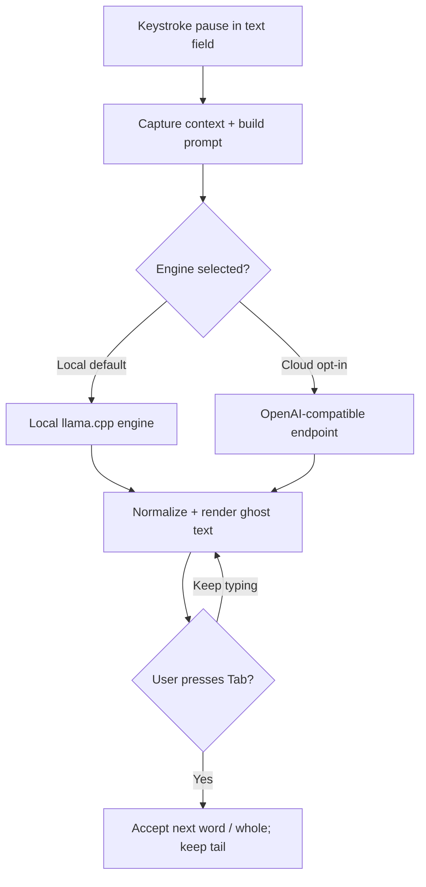

## Goal Capsule

- **Objective:** Mac users get a free, open-source, on-device autocomplete that produces smarter, better-tuned suggestions than Cotypist across the apps they write in, with a hybrid backend that keeps suggestion quality high even on Macs too small to fit a capable local model.
- **Product authority:** This plan owns the Libretype product: a fork of KeyType, a port of TabType's context pipeline, and an added hybrid engine. Surrounding areas (Cotypist-tier polish, an Apple Intelligence engine, mobile and other platforms) are not active scope.
- **Open blockers:** Confirm the durability thesis (A1) before planning invests in context/personalization over model size; verify TabType's speculative-parking mechanism ports to llama.cpp (A2); clear the "Libretype" name for trademark/domain collisions (A4).

## Product Contract

### Summary

Libretype is a MIT-licensed, open-source macOS autocomplete app that beats Cotypist on suggestion quality. It forks KeyType (modular SwiftPM, llama.cpp engine, already shipping with encrypted writing-history personalization, model management, constrained-generation, and mid-line), adds a remote OpenAI-compatible engine for a hybrid backend (local by default, cloud API key for weak machines), and ports TabType's context pipeline (AX-tree transcripts, document-aware context, text-mirroring) into KeyType's existing context, compatibility, and UI packages. It is free, with a suggested $5 donation.

### Problem Frame

Cotypist proved system-wide, on-device LLM autocomplete for macOS: a ~3 GB local Gemma/Qwen model via llama.cpp, ghost text in any app, Tab to accept, learns your voice. It is closed-source and freemium ($8/$12/mo, 100 free words/day), so users who want it free and open have no polished option. The open alternatives each force a trade: KeyType is modular and MIT but has a weaker context pipeline; TabType has the deepest context pipeline but is alpha and Apple-Silicon-only; Cotabby is polished and has a hybrid engine but is AGPL. A user who wants to release a free, open, better-tuned alternative they own — for adoption, stars, and reputation, donation-supported — has to combine the best of these under a permissive license rather than pick one or rebuild from scratch.

### Requirements

**Suggestion quality**

- R1. Suggestions must be better-tuned than Cotypist for the same input, with suggestion quality prioritized over speed, RAM footprint, and coverage when they conflict.
- R2. The local engine must use base-model continuation: the prompt ends at the cursor, not a chat/instruct prompt.
- R3. The app must support mid-line completion (completing from the middle of a line, not only at the end).
- R4. The app must support constrained generation (logit masking / admissibility) to shape suggestions.

**Hybrid backend**

- R5. Suggestions must generate on-device by default via a local engine, with no network required for the default path.
- R6. The app must support an optional cloud engine using a user-supplied API key against an OpenAI-compatible endpoint, so Macs that cannot fit a capable local model still get high-quality suggestions.
- R7. The cloud engine must be opt-in and disclose the network use; it sends only a bounded request to the user-configured endpoint.

**Context and personalization**

- R8. The app must capture accessibility-tree transcripts of the visible conversation in chat apps and chat websites, normalized for prompt stability.
- R9. The app must be document-aware: in long-form writing apps it reads a window around the cursor plus the document's opening lines.
- R10. The app must learn the user's writing via encrypted on-device writing history (on by default, user-controllable) and use it to tune suggestions.
- R11. The app must render ghost text via text-mirroring where the host app requires it, so suggestions pixel-match across apps.
- R12. The app must apply per-app and per-website policies (enable/disable, context recipe, tone, language).

**Coverage**

- R13. The app must work across standard macOS text fields (Mail, Slack, Notes, browsers, Notion, etc.) without per-app setup for most apps.
- R14. The app must work in terminals, including AI-agent prompt boxes.
- R15. Where coverage conflicts with suggestion quality, quality wins; suppression is preferred over a wrong suggestion. Governs R13, R14.

**Privacy**

- R16. No text the user types leaves the device unless the user explicitly enables the cloud engine.
- R17. The app must never read password or secure fields.
- R18. Screen/OCR context must remain opt-in; personalization data must be stored encrypted on-device.

**Product, license, distribution**

- R19. The app must be open-source under MIT.
- R20. The app must be free, with monetization via a suggested $5 donation (Ko-fi / GitHub Sponsors) and no paywall.
- R21. The app must be rebranded from KeyType to Libretype (name, bundle identifier, icons).

**Contributor onboarding and engine parity** (added 2026-08-30 from `docs/research/2026-08-30-fork-architecture-anchors.md`)

- R22. A clean clone of the repository must build without a manual bootstrap step. Upstream's llama.cpp binding is a gitignored local path, so a fresh clone currently fails to build (RN-1). Adoption is the success metric, and a broken first build is the largest single loss of contributors.
- R23. The remote engine must enforce the suppression discipline at the text level. `ConstrainedGeneration` operates on logits and is structurally unavailable to a remote engine (RN-2a), so without a text-level post-filter the remote path silently violates R15 while presenting itself as the higher-quality option.
- R24. Engine selection must be observable per request: which engine served it, its latency, and whether the result was shown or suppressed. Without this, the quality thesis in KD2 cannot be measured across a hybrid backend.

### Key Decisions

- KD1. Fork KeyType as the base. (session-settled: user-directed — chosen over contribute-upstream / build-from-scratch / fork-TabType / fork-Cotabby: wants own MIT product to control, brand, and ship; KeyType's modular engine/app split and existing personalization, model management, and app compatibility minimize customization.) Governs R1–R21.
- KD2. Suggestion quality is the primary axis; speed, RAM, and coverage are trade-able. (session-settled: user-directed — chosen over speed/RAM/coverage as primary: smarter, better-tuned completions are the differentiator.) Governs R1, R15.
- KD3. Hybrid backend: local llama.cpp plus an optional OpenAI-compatible cloud engine for weak machines. (session-settled: user-directed — chosen over local-only: quality on weak machines via cloud.) Governs R5–R7.
- KD4. MIT license; free with a suggested $5 donation; no paywall. (session-settled: user-directed — chosen over AGPL and over a paid tier: maximize adoption, stars, and dev reputation; donations, not a paywall.) Governs R19, R20.
- KD5. Name "Libretype" — own brand, "free type," no Cotypist echo. (session-settled: user-directed — chosen over Libretypist / Folktype / Openstroke / Freetypist: own brand that scales and signals free without copying the incumbent.) Governs R21.
- KD6. Port TabType's context pipeline (AX-tree transcripts, document-aware context, text-mirroring) into KeyType's existing packages rather than build context from scratch. (session-settled: user-approved — agent proposed the MIT-safe combine; user accepted.) Governs R8–R12.
- KD7. Reuse KeyType's engine/app architecture (ModelRuntime as the engine; the other packages as the app) rather than rebuild the macOS integration layer. (session-settled: user-directed — chosen over build-from-scratch: do not rebuild accessibility, ghost-text, and insertion plumbing.) Governs R5, R13, R14.
- KD8. No Cotabby code is used; its hybrid-engine pattern is re-implemented from scratch if referenced, to stay MIT. (session-settled: user-directed — chosen over an AGPL combine that includes Cotabby code: keep MIT.) Governs R19.

**Added 2026-08-30, anchored in `docs/research/2026-08-30-fork-architecture-anchors.md`.**

- KD9. Track KeyType as the `upstream` git remote and customize by **adding** packages, not by modifying or renaming upstream files. (research-settled: upstream `AGENTS.md` mandates "extend the existing module graph; do not rewrite it," and the repository now carries KeyType's 170 commits, so cheap merges are a standing asset worth protecting. Chosen over a clean-room reimplementation and over a hard divergence.) Governs R1, R21, KD1, KD7.
- KD10. Port TabType once, per-file, with attribution headers; do not track it as a dependency. (research-settled: RN-4 — TabType's engine layer is MLX-based where Libretype is llama.cpp-based, so only the model-agnostic context files are portable. Chosen over a wholesale port and over a SwiftPM dependency.) Governs R8–R12, KD6.
- KD11. Bind llama.cpp as a **checksum-pinned URL** `binaryTarget` rather than upstream's gitignored local path, keeping a documented local-path override for llama.cpp development. (research-settled: RN-1 — llama.cpp officially documents the URL + checksum form; upstream ADR-007's choice of the prebuilt xcframework is kept, only the binding changes. Chosen over the local-path binding and over building llama.cpp from source in-repo.) Governs R22.
- KD12. Introduce a **suggestion-level** engine seam (request in, result out, with partial streaming) above `LocalModelRuntime`, and route local versus remote there. (research-settled: RN-2 — `LocalModelRuntime` is token/logit-level and cannot be satisfied by a remote API that returns text; upstream ADR at `docs/05-decisions.md:527` requires the protocol stay linear and stable for `StubModelRuntime`. Chosen over widening `LocalModelRuntime` and over a remote-only fake runtime.) Governs R5–R7, R23, R24, KD3.
- KD13. Libretype's durable edge against a future Apple-native system-wide autocomplete is **personalization, model freedom, and terminal/all-app coverage** — not a bigger or better model. (session-settled: user-directed, closing gate G1 and assumption A1 — chosen over "raw quality from a bigger local model" and over "being free and open source is itself the edge." Apple can out-model anyone and will serve its own first-party surfaces well; it will not ship a user-inspectable personal writing model, arbitrary local model choice, or a user-supplied remote endpoint, and it has historically underserved terminals and third-party apps.) Consequences: effort goes to the context and personalization port (S2–S4) ahead of any model scaling, and **coverage stops being freely trade-able despite KD2** — R13 and R14 are load-bearing for durability, so they may be deferred but not dropped. Governs R8–R12, R13, R14; constrains KD2.

### Research Gates

Each gate must be closed before the sprint it blocks. An unresolved gate is a reason to stop, not a
reason to guess.

| Gate | Question | Blocks | Method |
| --- | --- | --- | --- |
| ~~G1~~ | ~~Durability thesis~~ | — | **Closed 2026-08-30 → KD13.** |
| G2 | Which local model, at which quantization, on which hardware floor? | S2 | Benchmark candidates on the S1 harness; decide on measured quality-per-GB, not reputation. |
| G3 | Does TabType's text-mirroring overlay survive a port to llama.cpp (A2, A3, OQ2)? | S3 | Port mirroring alone and measure. Do not port the file set speculatively. |
| G4 | Is "Libretype" clear of trademark and domain collisions (A4)? | Public S0 | USPTO, App Store, `.app`/`.dev` availability. Must close before the repo goes public. |
| G5 | Apple Developer ID, notarization, and Gatekeeper path for an unsigned fork. | S7 | Apple developer documentation; determines whether v1 can be installed without a right-click bypass. |
| G6 | Intel Mac support: does the llama.cpp path stay usable, and at what quality floor? | S2 | Measure. Upstream targets macOS 14+ without an Apple-Silicon restriction, so this is a quality question, not a compatibility one. |
| G7 | Which remote endpoints are supported (RN-3)? | S5 | `/v1/completions` is the baseline and `/infill` an optional capability; hosted providers deprecating raw-prompt completions may break the base-model premise. |

### Key Flows

- F1. Suggestion generation.
  - **Trigger:** The user pauses typing in a focused text field.
  - **Actors:** Local engine (default), cloud engine (opt-in).
  - **Steps:** Capture context (AX transcript / document window / writing history) → build a base-continuation prompt → route to the selected engine → generate → normalize → render ghost text.
  - **Covered by:** R1–R14.

- F2. Hybrid engine selection.
  - **Trigger:** A generation request is built.
  - **Steps:** The router selects the local engine by default, or the cloud engine when the user has enabled it and supplied an API key (e.g., on a Mac that cannot fit a capable local model).
  - **Covered by:** R5–R7.

- F3. Acceptance.
  - **Trigger:** The user presses Tab while a suggestion is shown.
  - **Steps:** Accept the next word (or the whole suggestion), insert it, and keep the remaining tail alive for the next accept.
  - **Covered by:** R13.

### Acceptance Examples

- AE1. **Covers R5–R7.** **Given** a Mac that cannot fit the chosen local model, **when** the user enables the cloud engine and supplies an API key, **then** suggestions come from the user-configured OpenAI-compatible endpoint and the UI discloses the network use; without the key, the local engine is used and no network call is made.
- AE2. **Covers R8, R9.** **Given** the user is typing in a chat app, **when** a suggestion is requested, **then** the prompt includes the normalized AX-tree transcript of the visible conversation; **given** a long-form writing app, **then** it includes the document's opening lines plus a window around the cursor.
- AE3. **Covers R15.** **Given** an app where rich context is unavailable or low-confidence, **when** context richness conflicts with suggestion quality, **then** the app suppresses the suggestion rather than showing a low-quality one, even if that means no suggestion in that app.
- AE4. **Covers R16–R18.** **Given** focus is in a password or secure field, **when** a generation would otherwise fire, **then** no generation, presentation, or insertion occurs.

### Scope Boundaries

**Deferred for later**

- Cotypist-tier polish: emoji shortcodes, inline macros, autocorrect, a Homebrew cask, notarization, and Sparkle-style auto-update.
- An Apple Intelligence (FoundationModels) engine.
- Mobile (iOS/iPadOS), Windows, and Linux.
- Intel-Mac optimization (supported by the llama.cpp path but not tuned).
- Model fine-tuning or training a custom model.
- A paid tier.

**Outside this product's identity**

- A closed-source or proprietary product — Libretype is open-source MIT.
- A cloud-dependent product — the default is on-device; the cloud engine is opt-in.
- A Cotypist-derivative brand — Libretype is its own brand, not a "free Cotypist" clone.

### Dependencies / Assumptions

**Dependencies**

- KeyType (github.com/johnbean393/KeyType, MIT) as the fork base — modular SwiftPM packages, llama.cpp engine, encrypted writing-history personalization, model management, constrained-generation, mid-line, tests + bench, macOS 14+.
- TabType (github.com/nilava/TabType, MIT) as the context-pipeline port source — AX-tree transcripts, phrase memory, per-app policies, document-aware context, text-mirroring; MLX backend (Apple-Silicon-only).
- llama.cpp (via KeyType's ModelRuntime) for the local engine.
- An OpenAI-compatible endpoint (user-configured) for the cloud engine.
- macOS 14+.

**Assumptions**

- ~~A1. Durability thesis~~ — **resolved 2026-08-30, promoted to KD13.** No longer an assumption.
- A2. TabType's speculative-parking mechanism (a `speculative` flag in its `SuggestionEngine`) ports to KeyType's llama.cpp runtime; the exact parked-generation mechanism was not pinned in the audit and may need rework rather than copy.
- A3. The port's hardest piece is adapting TabType's MLX-coupled text-mirroring overlay and speculative-parking to KeyType's llama.cpp runtime; the AX-tree transcript and document-aware parts are largely model-agnostic and port cleanly.
- A4. The name "Libretype" is clear of trademark and domain collisions; unverified — must be checked (USPTO, Apple App Store, .app/.dev) before finalizing.

### Outstanding Questions

- ~~OQ1~~ **Resolved 2026-08-30.** The durability thesis is settled as KD13: personalization + model freedom + terminal/all-app coverage. Planning invests in the context and personalization port, not in a bigger local model.
- OQ2. **Deferred to Planning.** Pin TabType's speculative-parking mechanism (A2) against `MLXEngine` / `SuggestionEngine` and decide port-versus-rework for the llama.cpp runtime.

### Sources / Research

**Primary research note:** `docs/research/2026-08-30-fork-architecture-anchors.md` — RN-1 (clean clone cannot build; llama.cpp's documented checksum-pinned URL `binaryTarget` is the fix), RN-2 (`LocalModelRuntime` is logit-level and cannot host a remote engine; Cotabby's suggestion-level router is the pattern), RN-2a (`ConstrainedGeneration` is local-only, creating a quality asymmetry that R23 covers), RN-3 (`/v1/completions` is the correct remote surface, `/v1/chat/completions` is wrong, `/infill` fits mid-line), RN-4 (corrected port inventory).

- llama.cpp `docs/xcframework.md` and `tools/server/README.md`, retrieved via Context7 MCP (`/ggml-org/llama.cpp`) — the URL + checksum `binaryTarget` form, and the `/v1/completions`, `/v1/chat/completions`, `/infill` endpoint contracts.
- Upstream working tree at `21df2cc`: `AGENTS.md` (product principles, module-graph rule), `.gitignore:35-36` (`Packages/ModelRuntime/Vendor/`), `docs/05-decisions.md:274-286` (ADR-007, xcframework build `b9402`) and `:527-529` (`LocalModelRuntime` deliberately linear), `Packages/ModelRuntime/Sources/ModelRuntime/ModelRuntime.swift:56` (the protocol).
- Repository state: this repo carries KeyType's full 170-commit history on `main`, tracking the `upstream` remote. Reference clones live outside the repo at `~/libretype-refs/{cotabby,keytype,tabtype}`. Licenses verified from each clone's `LICENSE`: KeyType MIT (Xi Nai Lai), TabType MIT (TabType contributors), Cotabby AGPL-3.0.

- KeyType (github.com/johnbean393/KeyType) — MIT; 15 SwiftPM packages under `Packages/` (AutocompleteCore, ModelRuntime, ModelManagement, Personalization, ProfileBuilder, Prompting, ConstrainedGeneration, TokenProfiles, MacContextCapture, CompletionUI, TextInsertion, AppCompatibility, KeyTypeBench); llama.cpp engine in `ModelRuntime/Sources/LlamaModelRuntime`; encrypted writing-history in `Personalization`; mid-line (`allowsMidLineCompletion`); tests + bench. macOS 14+. Audited locally.
- TabType (github.com/nilava/TabType) — MIT; MLX backend (`mlx-swift-lm`); context features verified in code: `Core/TranscriptExtractor.swift`, `Core/TranscriptNormalizer.swift`, `Core/PhraseMemory.swift`, `Core/AppPolicy.swift` (+ `AppPolicyStore`), `Core/PromptBuilder.swift` (`<document_start>`), `Core/SuggestionOverlay.swift` (mirror mode), `Core/Engines/SuggestionEngine.swift` (`speculative` flag). Apple-Silicon-only. Audited locally.
- Cotabby (github.com/FuJacob/cotabby) — AGPL-3.0; three-engine design verified in `Cotabby/Services/Runtime/{AppleIntelligence, Llama, OpenAICompatible}` + `SuggestionEngineRouter`. Used as the architectural reference for the hybrid-engine pattern, not as a code source (AGPL).
- CotabbyInference (github.com/FuJacob/cotabbyinference) — MIT; narrow C++ llama.cpp wrapper; the architectural reference for the engine/app separation.
- Cotypist (cotypist.app) — closed-source incumbent; local Gemma/Qwen via llama.cpp, ~3 GB model, macOS 14+ Apple Silicon, freemium. Tech stack reconstructed from public docs and reviews.
